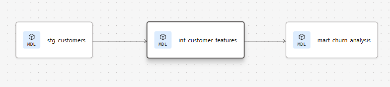
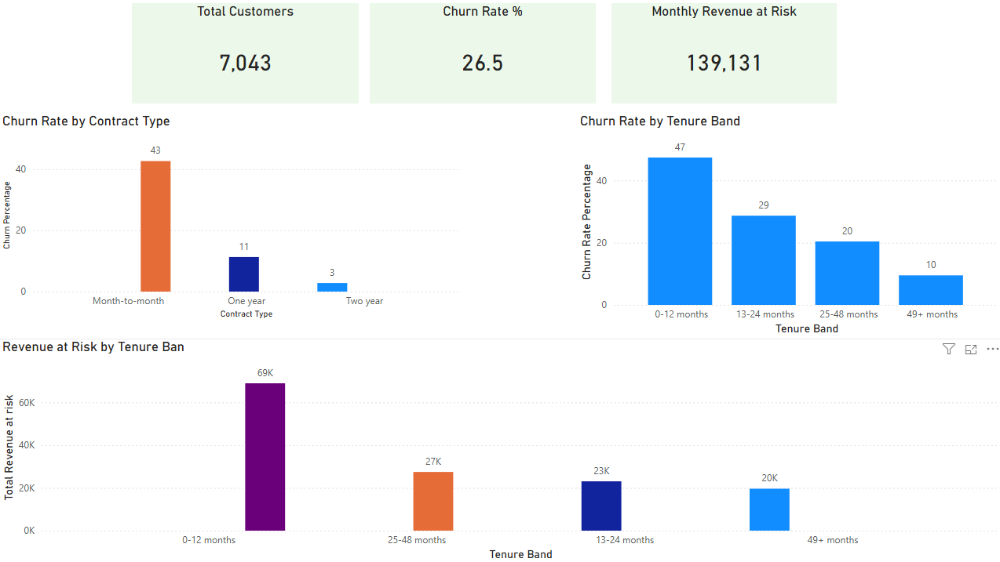

# Telecom Customer Churn — ELT Pipeline

## Overview
End-to-end ELT pipeline analysing customer churn for a telecom provider.
Built to identify which customer segments are most likely to churn 
and quantify monthly revenue at risk.

**Key finding:** Month-to-month customers in their first 12 months 
have a churn rate of ~72%, putting over €28,500 of monthly 
recurring revenue at risk from that segment alone.

## Architecture

Raw CSV → Snowflake (RAW schema)
       → dbt staging (clean & type cast)
       → dbt intermediate (business logic & risk scoring)
       → dbt marts (aggregated KPIs)
       → Power BI dashboard

## Tech Stack
| Tool | Purpose |
|------|---------|
| Snowflake | Cloud data warehouse |
| dbt Cloud | ELT transformations, testing, documentation |
| Power BI | Dashboard & reporting |
| Git | Version control |

## Project Structure

models/
├── staging/
│   ├── sources.yml          # Raw source definition
│   ├── schema.yml           # Column tests & documentation  
│   └── stg_customers.sql    # Clean & type cast raw data
├── intermediate/
│   └── int_customer_features.sql  # Business logic & risk scores
└── marts/
    ├── mart_churn_analysis.sql       # Full segmentation
    ├── mart_churn_by_contract.sql    # Churn by contract type
    └── mart_churn_by_tenure.sql      # Churn by tenure band

## dbt Layers Explained
- **Staging** — raw data cleaned and typed. All columns cast from 
  VARCHAR to correct types. Yes/No strings converted to booleans. 
  Blank TotalCharges values safely handled with TRY_TO_DOUBLE.
  
- **Intermediate** — business logic applied. Tenure banding, 
  number of services calculation, churn risk scoring (0-5 scale), 
  and monthly revenue at risk per customer.
  
- **Marts** — aggregated KPIs by segment. Ready for direct 
  consumption by Power BI.

## Data Quality Tests
5 automated dbt tests run on every build:
- `customer_id` — unique, not_null
- `gender` — accepted_values (male, female)
- `contract_type` — accepted_values
- `has_churned` — not_null

## Key Business Insights
1. **Contract type is the strongest churn signal** — month-to-month 
   customers churn at 3x the rate of two-year contract customers
2. **First 12 months is critical** — highest churn rate AND highest 
   revenue at risk by tenure band
3. **€28,500+ monthly revenue at risk** from the highest-risk 
   segment (month-to-month, 0-12 months)
## Dashboard

## How to Run
1. Set up Snowflake free trial at snowflake.com
2. Load raw CSV to `telecom_dw.raw.telco_customers`
3. Connect dbt Cloud to Snowflake
4. Run `dbt run` to build all models
5. Run `dbt test` to validate data quality
6. Connect Power BI to `telecom_dw.dbt_dev_marts`

## Dataset
IBM Telco Customer Churn dataset — 7,043 customers, 21 features.
Available on Kaggle: https://www.kaggle.com/datasets/blastchar/telco-customer-churn
